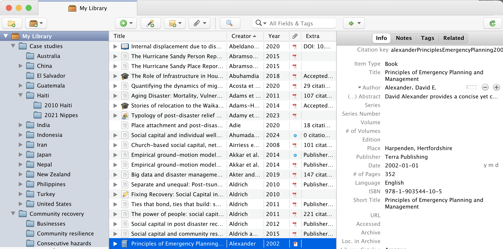
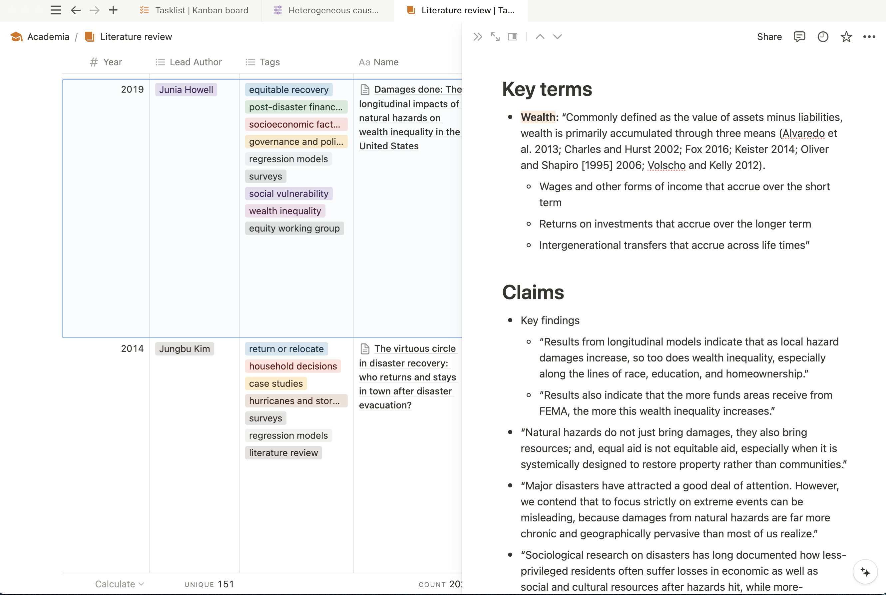
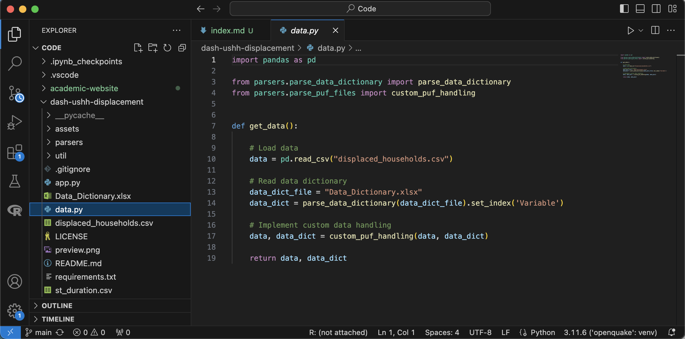
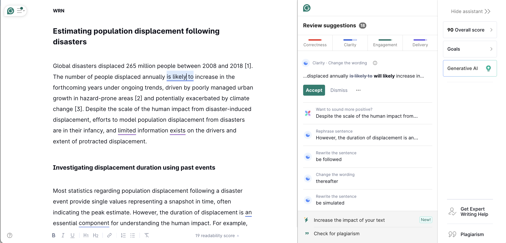
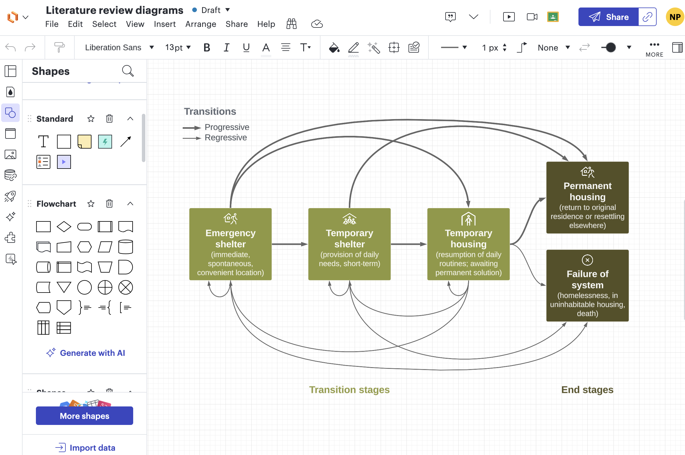
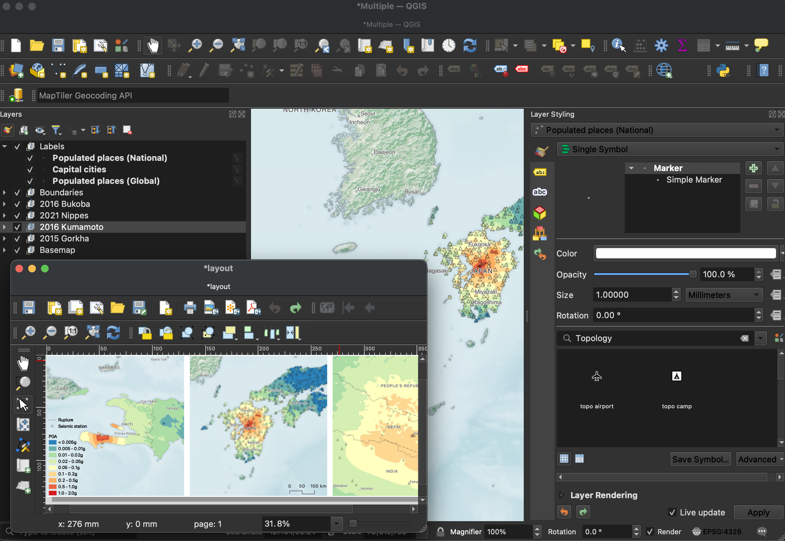

## Introduction

As I wrap up my second year of the PhD, I'm reflecting on some of the tools that I've found most useful during my studies. Please see the list below, organized by category. Note that most of these tools offer both free and paid versions. Before purchasing a paid plan for any of these tools, check to see if you qualify for a free or discounted paid plan first! This could either be directly through your university or through a student discount.

## Literature review

### Zotero: Managing references and citations

As researchers, we constantly encounter new literature on topics of potential interest: journal articles, books, news articles, and so on. There's never enough time to read through it all, but we might want to file away the item for future reading.

I use Zotero to file away any potentially relevant item, which can then be organized into folders or subfolders as I see fit. The item will become a part of my library, which I can search through later and integrate with my preferred text editor (e.g., Microsoft Word, Overleaf) to easily cite. Zotero makes managing citations as painless as possible: the relevant fields are often automatically downloaded correctly, but can be fixed or entered just once rather than constantly requiring manual effort for each subsequent citation.

[**Zotero**](https://www.zotero.org/) is completely free to use. Additionally, there are some potentially useful [plugins](https://www.zotero.org/support/plugins). Personally, I use the Zotero Word for Mac Integration, Better BibTex for Zotero, and Zotero Citation Counts Manager plugins.

### Notion: Organizing searchable notes on relevant literature

Once it's time to read a potentially relevant literature item (e.g., journal article, book chapter), I like to take notes using a standard template with Notion. These notes are added to my literature review database, which I can easily search or filter for future purposes.

[Feel free to duplicate my literature review template and make it your own!](https://litreview.notion.site/) If you decide to use my literature review template, I suggest that you tailor your effort in note-taking based on its relevance to your research. If the paper seems highly relevant, take care to rephrase key claims in your own terms. If the paper is less relevant, feel free to copy and paste relevant text snippets, but use quotation marks (`"`) to clearly indicate to yourself that you did not rephrase it as to avoid plagiarism when you refer back to your notes later on. Regardless, I always find it useful to write a short paragraph summary of the item using my own words, which helps me to recall the key contributions of the item later on.

While my main use of Notion is for the literature review database, I also use Notion for other purposes: managing to-do lists with a Kanban board, draft paper outlines using a minimalist interface, taking notes on different analysis methods (e.g., saving relevant links and code snippets).

[**Notion**](https://www.notion.so/) has both free and paid plans. [However, students and educators are eligible for a free paid plan](https://www.notion.so/product/notion-for-education). There are also various [integrations](https://www.notion.so/integrations/all) that could be useful.

### Google Scholar: Staying up-to-date with new literature

I think most of us are probably already familiar with [Google Scholar](https://scholar.google.com/) and using the search engine to find potentially relevant scientific articles. However, something I find particularly useful is [**Google Scholar Alerts**](https://scholar.google.com/scholar_alerts?view_op=list_alerts&hl=en). These custom alerts allow me to stay up-to-date with all potentially relevant literature in my study area. 

Every working day, I open the email alerts and scan the titles to see if any of the results seem interesting and useful to my research. If so, then I will file that item in my Zotero library at that time. I rarely read the item right away, but it will at least be easy for me to find later on when relevant. 

## Code and data analysis

### GitHub: Storing, managing, and sharing code

Do you plan to use code in your work or research? If so, I recommend getting comfortable with [Git](https://git-scm.com/) sooner rather than later. GitHub is an online Git provider or hosting service, but there are also many other options available: Bitbucket, GitLab, and so on. If you're new to it, I think GitHub is a great one to start with: it has the largest user base and integrates well with several other tools. 

{}
**Git** is distributed version control system: it tracks changes to files, maintains a copy of your work, and eases collaboration across multiple contributors.
{}

Again, if you're new, I recommend spending a few hours to first familiarize yourself with Git before getting too far ahead. There are tons of online resources, but [this one](https://docs.github.com/en/get-started/start-your-journey/hello-world) might be a good starting point if you decide to proceed with GitHub.

[**GitHub**](https://github.com/) offers both free and paid plans. [Students and educators are eligible for a discounted paid plan](https://education.github.com/pack/join). Personally, I find the paid plan worthwhile, but I don't think it's necessary for all users.

### VSCode: General purpose code editor

When you get started with coding/programming, you have the option to use a general text/code editor versus one that is specifically designed for your language of choice (i.e., an Integrated Development Environment or IDE).

General code editors include Emacs, VSCode, Sublime, and Vim. Some IDEs for Python include Spyder, PyCharm, and IDLE. If you're just starting out, I recommend you consider the following questions before deciding between a general code editor versus an IDE. I'll use Python as the programming language in consideration here, but the same logic would apply to another language:

* Do I really want a built-in debugger for the Python language? If yes, then consider something like Spyder or PyCharm

* Do I foresee a need to support languages aside from just Python (e.g., I might want to build a personal website in Python, which requires HTML/CSS)? If yes, then consider a more flexible text editor like VSCode

* Do I want to get started ASAP, rather than have a longer setup cost? If yes, consider a Python IDE. If you're previously familiar with a language like MATLAB, Spyder will give you a familiar experience

All that said, I personally recommend [**VSCode**](https://code.visualstudio.com/). It's free and offers a large number of [extensions](https://marketplace.visualstudio.com/vscode) to help you customize your experience. For example, you would commonly download an extension to support your programming language of choice (e.g., `Python`, `R`). I also have some extensions to help me easily view different file formats (e.g., `Excel Viewer`, `vscode-pdf`) and an extension to support Jupyter notebooks (`Jupyter`).

## Written communication

### Grammarly: Improving grammar and clarity

All that effort and work you put into your research can easily be lost if you are unable to effectively communicate it to the relevant audiences. This recommendation is specific to those who are writing in the English language, but I think it applies regardless of whether or not you are a native speaker. When I'm asked to review another peer's paper or report, I often find that the bulk of my edits and comments are related to the clarity of writing, which could easily be addressed independent of me using an app like Grammarly.

[**Grammarly**](https://app.grammarly.com/) has both free and paid versions. [There also seems to be a free paid version for students.](https://www.grammarly.com/students) If you're able to afford it, I do generally recommend the paid version as it includes recommendations to improve you writing's clarity. If you're unable to afford the paid version but still want to improve the clarity of your writing, then I suggest tracking down a copy of Strunk and White's [*Elements of Style*](https://en.wikipedia.org/wiki/The_Elements_of_Style).

### Overleaf: A browser-based LaTeX editor

Microsoft Word is great for shorter and simpler documents. However, after a certain number of tables, citations, and tracked changes, the technology starts to break down. For many in academia, this is where LaTeX often comes into play. For more on LaTeX, please see [this blog post](https://blog.orvium.io/latex-over-word/).

{}
**LaTeX** is a writing software where users write text and code to prepare and typeset documents.
{}

Once you become convinced to give LaTeX a try, I recommend Overleaf as an easy-to-use online LaTeX editor. Additionally, Overleaf integrates with Zotero (to manage your citations) and Github (to manage your files). I also recommend browsing some of Overleaf's [templates](https://www.overleaf.com/latex/templates) to get started with your next journal article, resume/CV, or thesis!

[**Overleaf**](https://www.overleaf.com/) offers both free and paid plans. [There is also a discount paid plan for students](https://www.overleaf.com/user/subscription/plans#student-annual). However, I think many universities partner with Overleaf and offer free paid accounts to their students. A paid account is required to invite collaborators (e.g., your supervisor, a co-author).

## Visual communication

### Web icons for presentations and graphics

Icons are a great way to efficiently communicate information in your presentations or graphics. Practically, icons are often downloadable in a vector format (e.g., svg), which allows easy customization in Microsoft PowerPoint, in other software and apps, or online (e.g., for your personal website). For example, here is an icon that signifies a paper is open access: <i class="ai ai-open-access ml-1"></i>

There are many providers for web icons. Below is a non-exhaustive list:

* [Font Awesome](https://fontawesome.com/)

* [Iconbuddy](https://iconbuddy.com/)

* [Iconscout](https://iconscout.com/)

* [Flaticon](https://www.flaticon.com/)

* [Academicons](https://jpswalsh.github.io/academicons/)

* [Blendicons](https://blendicons.com/)

Most offer both free and paid options. Unless you are a web developer, paid plans are probably not cost-effective.

### LucidChart: Easy diagrams and flowcharts

LucidChart is a browser-based application that allows you to easily drag-and-drop content to create diagrams and flowcharts. The results can be downloaded in vector format, which display beautifully in presentations or other documents. Tip: Import a library of web icons (see above) so that you can easily use them in your graphic creation.

[**LucidChart**](https://www.lucidchart.com/pages) generally only offers a paid plan, which I personally would not opt for on a student budget. [However, students and educators are eligible for a free paid account.](https://help.lucid.co/hc/en-us/articles/360049831771-Sign-up-for-a-free-Educational-account) Check out their [templates](https://lucid.app/documents#/templates) for some ideas to get started.

## Personal website

Refer to my [blog post on making an academic website](../academia-website/) if you're curious about the specific tools and services I used to make this website!

## Other special mentions

### QGIS: Creating maps and performing geospatial analysis

I'll admit that there's a learning curve here. However, if you want to create custom maps or easily perform geospatial analysis without code, QGIS is a great (and free) option. 

Personally, I also find QGIS to be more user-friendly and intuitive than other GIS software. I'm considering writing a series of blog posts about how to create maps using QGIS in the future -- if that's of interest to you, let me know!

{}
A **Geographic Information System, or GIS**, handles geographically referenced data or information. Common software include ArcGIS and QGIS.
{}

[**QGIS**](https://www.qgis.org/) is free and open-source. Additionally, QGIS supports a variety of [plugins](https://plugins.qgis.org/) that could be relevant to your needs.

### Anki: Intelligent flashcards for memorization

Anki is a simple flashcard app that uses cognitive science techniques (e.g., spaced repetition, active recall testing) to aid memorization. Anki supports a variety of content types, including images and scientific markup.

Personally, I use Anki to reinforce vocabulary when learning foreign languages. I typically go through my Anki flashcards every day as a part of my morning routine. However, the use case for Anki extends well beyond learning or reinforcing foreign languages.

[**Anki**](https://apps.ankiweb.net/) is free and open source. Some [shared decks](https://ankiweb.net/shared/decks) are publicly available, but I personally prefer to create my own as I believe it helps with my recall ability.

### Babbel: Learning foreign languages

Perhaps you're studying in a country that speaks a different language from your native tongue, or perhaps you are conducting a field visit in a foreign country. If you need to learn a foreign language, I've personally found Babbel more useful than many alternatives.

Babbel arranges lessons around certain topics, starting off with the topics that might be most useful to you as a new visitor or tourist. New words are introduced in context and repeated in a variety of formats. Babbel might not be as fun or gamified as other common apps (e.g., Duolingo), but I find it to be more effective.

[**Babbel**](https://www.babbel.com/) only offers paid plans. They often offer discounts or promotions throughout the year, which I suggest waiting for if you can. Depending on how long you are invested in learning foreign languages, the lifetime membership (during a discount) could be a great deal and help you avoid subscription fatigue.