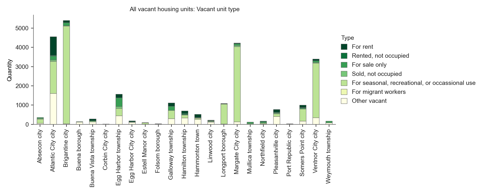

## Introduction

The United States Census Bureau makes several of their datasets available [via API](https://www.census.gov/data/developers/data-sets.html). This makes interacting with the data via code much more straightforward after some initial setup.

Accessing the American Community Survey (ACS) data in Python is made even easier with the [**census**](https://pypi.org/project/census/) library. The ACS provides aggregate population and housing statistics. Some of these variables are also available crossed (e.g., tenure by household size and by age of the householder). Additionally, all variables include a margin of error estimate.

## Getting started

### Installation and setup

This guide assumes that you have some basic familiarity using Python, including the ability to install custom libraries. For example, if you use pip to manage your Python libraries, you can simply call `pip install census`. 

{}
Use of the Census APIs requires a personal token, which you can request online for free by clicking the 'Request a key' banner on their <a href="https://www.census.gov/data/developers/about/terms-of-service.html" target="_blank">Terms of Service</a> page.
{}

The code snippets below use the following Python libraries:

* **pandas:** Common library to handle relational/labeled data [(repo)](https://github.com/pandas-dev/pandas)
* **census:** A wrapper for the Census API [(repo)](https://github.com/datamade/census)
* **us:** Eases working with United States and state metadata  [(repo)](https://github.com/unitedstates/python-us)

### Choose the relevant dataset

The datasets supported by the Python **census** library are listed in the repo's [readme](https://github.com/datamade/census?tab=readme-ov-file#datasets). 

Notably, there are different ACS datasets for different years. This includes a 5-year estimate and a 1-year estimate. Please see the Census Bureau's guidance for [which estimate type is better for your study](https://www.census.gov/programs-surveys/acs/guidance/estimates.html).

### Determine geographic unit

Each dataset supports different geographic aggregations. Since the ACS does not exhaustively sample _all_ households, margin of error estimates are associated with different geographic aggregations based on the corresponding sampling rate. The margin of error for finer resolutions (e.g., Census block group) is more significant than for coarser resolutions (e.g., at the county level).

{}
Geographic units are often specified using [FIPS codes](https://en.wikipedia.org/wiki/Federal_Information_Processing_Standard_state_code). Each state/territory is specified with a two-digit code (e.g., 06 for for California). These codes can be extended to specify finer geographic resolutions (e.g., another three digits to specify the county, plus six more digits to specify the tract, and so on)
{}

The supported geographic aggregations can be found on the [API examples](https://api.census.gov/data/2021/acs/acs5/subject/examples.html) page. For example, some options include:
* State (e.g., `state:06` would reference California)
* County (e.g., `state:06 county:001` would reference Alameda County, California)
* Tract
* Block group
* Place (e.g., municipalities, populated places, neighborhoods, towns/townships)
* Urban area

### Identify variable codes

Each variable has its own code. For example, the list of variable codes for the ACS5 (2021) is available at [ttps://api.census.gov/data/2021/acs/acs5/variables.html](https://api.census.gov/data/2021/acs/acs5/variables.html). However, the long list of variables makes using these API references cumbersome. Personally, I found this [reference](https://proximityone.com/apigateway_acs5year.htm) easier to quickly navigate the variables in combination with `Cmd+F` or `Ctrl+F` to search relevant keywords.

Another way to search the variable lists in Python is with the **census** library. For example, the following code snippet searches for all variables that include keywords 'mortgage status' in the latest ACS5 dataset.

```python
# Choose relevant dataset
dataset = c.acs5
# Get variable tables
tables = pd.DataFrame(dataset.tables())
# Create some filter criteria to search variables by
keyword = 'mortgage status'
criteria = tables.description.str.contains(keyword.upper())
# Preview result
tables[criteria]
```

## Code example

In this example, we extract information about the number of vacant housing units in Atlantic City, New Jersey at the county subdivision level.

```python
# Load dependencies
import pandas as pd
from census import Census
from us import states
# Load in your API key; replace API_KEY with your actual token
key = API_KEY
c = Census(key)
# Choose relevant census dataset
dataset = c.acs5
# Assign variable codes and their corresponding labels
variables = ('NAME', 'B25004_001E', 'B25004_002E',
             'B25004_003E','B25004_004E', 'B25004_005E',
             'B25004_006E', 'B25004_007E', 'B25004_008E')
labels =    ('NAME', 'All vacant', 'For rent',
             'Rented, not occupied', 'For sale only', 'Sold, not occupied',
             'For seasonal, recreational, or occassional use', 'For migrant workers', 'Other vacant')
# Choose desired geographic aggregation level
geo = 'county subdivision:*'
# Choose filter criteria (geographic extent)
county_code = '001'
criteria = f'state:{states.NJ.fips} county:{county_code}'
# Run query and store as DataFrame
r = dataset.get(variables,
          { 'for': geo,
            'in' : criteria})
df = pd.DataFrame(r).rename(columns={v: l for v, l in zip(variables, labels)})
```

The resulting estimates are plotted below for reference.

